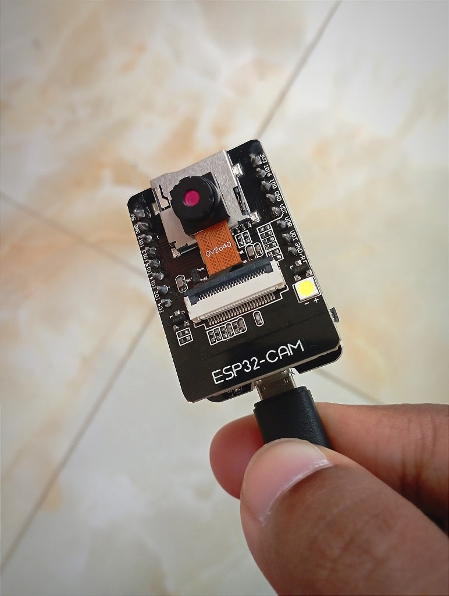

# companionpi/camera

## Overview

> This repository provides the code to operate an [**ESP32-CAM**][1] module to stream static images over Wi-Fi. Then a Raspberry Pi can process those images locally to detect people around it.

The source code is a modified version of this [**ESP32-CAM example sketch**][10].

## Prerequisites

### Hardware

-   [**ESP32-CAM Module (OV2640 Camera)**][5]
-   [**ESP32-CAM-MB Micro-USB Programmer Board**][6]
-   [**Micro-USB Data Cable**][7]

### Software

-   [**Arduino IDE** (**v2.3.2** or newer)][2]
-   [**ESP32 boards for Arduino (v2.0.16)**][3]
-   [**ESP32-CAM Library** by **Junxiao Shi**][4]

## Remarks

### Hardware

Apparently, there are variants of the ESP32-CAM module, and some of them are **NOT** 5V tolerant. However, the micro-USB programming board provides 5V, which can damage the ESP32-CAM module. We should be careful while buying the module-programmer pair and double-check whether those are 5V tolerant.

Additionally, we can program the 3.3V variants with an [**FTDI USB to Serial Converter**][8]. Make sure to switch the jumper to 3.3V first.

### Software

Although some tutorials suggest using the **ESP32 Wrover Module** board, I could **NOT** make it work with my ESP32-CAM. Then, I used the **AI Thinker ESP32-CAM** board, and it worked like a charm.

It is [**recommended**][9] to set a slower upload speed (**115200 baud**) to ensure stable serial communication between the module and the computer.

## History

New patches and stability features will be added over time.

### v1.0.0 (13 Jun 2024)

-   Initial release

## License

The library and the source code is licensed under the [**ISC license**][0].

<!-- links go here -->

[0]: https://github.com/yoursunny/esp32cam/blob/main/LICENSE
[1]: https://randomnerdtutorials.com/esp32-cam-video-streaming-face-recognition-arduino-ide/
[2]: https://www.arduino.cc/en/software
[3]: https://espressif.github.io/arduino-esp32/package_esp32_index.json
[4]: https://github.com/yoursunny/esp32cam
[5]: https://store.roboticsbd.com/arduino-boards/1407-esp32-cam-wifi-bluetooth-camera-module-development-board-esp32-with-camera-module-ov2640-robotics-bangladesh.html
[6]: https://store.roboticsbd.com/internet-of-things-iot/2044-esp32-cam-mb-micro-usb-download-module-for-esp32-cam-development-board-robotics-bangladesh.html
[7]: https://www.ryans.com/ugreen-usb-male-to-micro-usb-1-meter-black-usb-cable
[8]: https://store.roboticsbd.com/robotics-parts/658-ftdi-usb-to-ttl-serial-converter-adapter-ft232rl-in-bangladesh.html
[9]: https://arduino.stackexchange.com/a/93933
[10]: https://github.com/yoursunny/esp32cam/tree/main/examples/WifiCam
